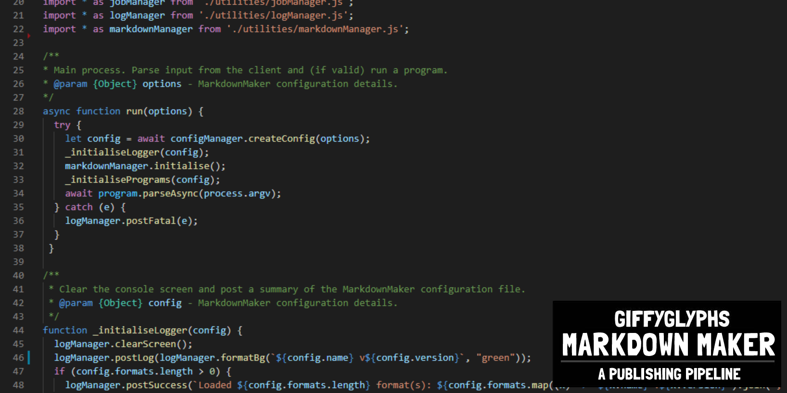

# Changelog

## v2.0.1
* Format now specifies a markdownMaker version, not publisher.

## v2.0.0
* Added GPLv3.0 license.
* Added author/description fields to format/project.js.
* Added maker configuration class.
* Added "check" program to confirm setup is valid.
* Added jsonManager and integrated it with build processes.
* Removed pagebreak markdown extension; no longer needed.
* Renamed extension to content for more cross-format flexibility.
* Added markdown extensions for tables and figures.
* Added changelog and readme.

## v1.0.1
* Updated package.json to use _dependencies_, not devDependencies.

## v1.0.0
* First working commit of the project.
* Total overhaul of the original _Book Binder_ codebase.
* Converts **markdown** into HTML using **marked.js**.
* Applies scripts, stylesheets, and more.
* Added support for four programs: build, clean, watch, and export.
* Can export artifacts in four formats: PDF, PNG, JPG, and ZIP.
* Added basic markdown extensions (page, example, panel, colbreak, pagebreak, etc).
* Added eslint support to check/enforce code standards. Can run with "npm run lint-js".
* Fully documented code with jsdoc. Can generate documentation with "npm run generate-docs".
